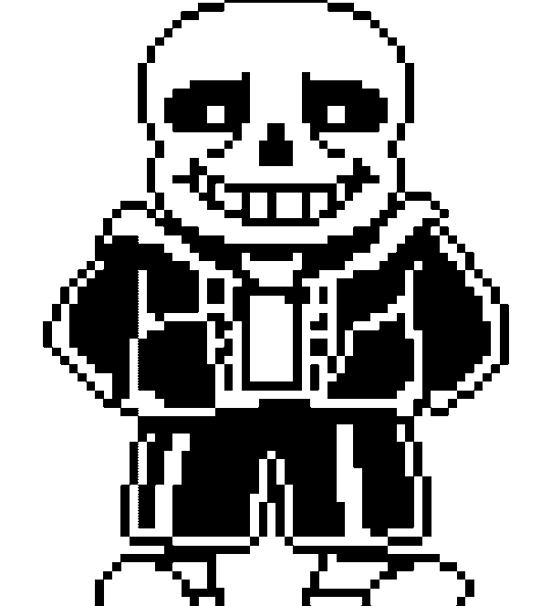
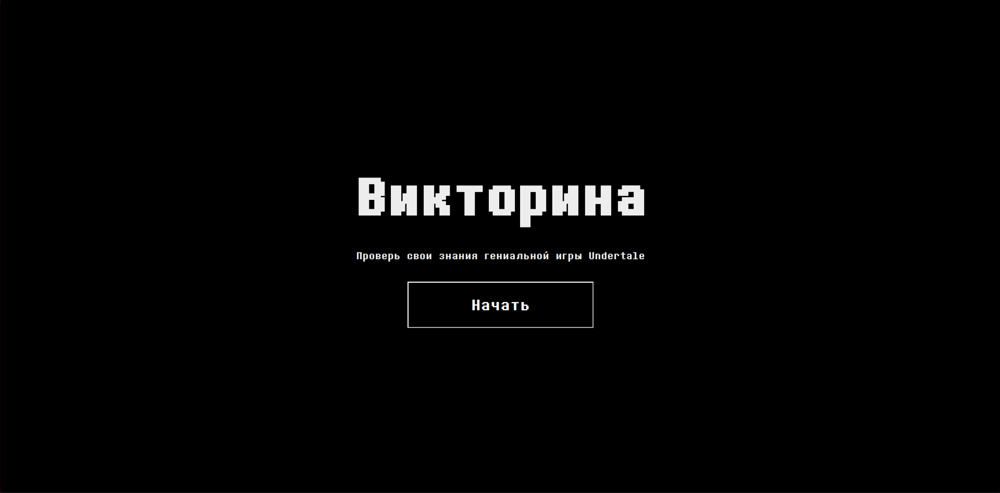
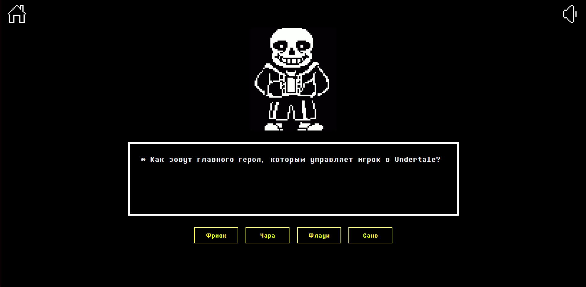

# Викторина по Undertale 

Этот проект представляет собой интерактивную викторину, основанную на игре Undertale. Проект разработан с использованием Next.js, React и других современных веб-технологий.

## Описание

Викторина позволяет пользователям проверять свои знания об игре Undertale, отвечая на вопросы и получая обратную связь. Проект включает в себя следующие функции:

- Вопросы с несколькими вариантами ответов и открытые вопросы.
- Звуковые эффекты и музыкальное сопровождение.
- Возможность включать и выключать звук.
- Переход между страницами для навигации по викторине.

## Технологии

- **Next.js**: Основной фреймворк для создания приложения.
- **React**: Библиотека для создания пользовательских интерфейсов.
- **use-sound**: Хук для воспроизведения звуков.
- **CSS Modules**: Для стилизации компонентов.
## Внешний вид

